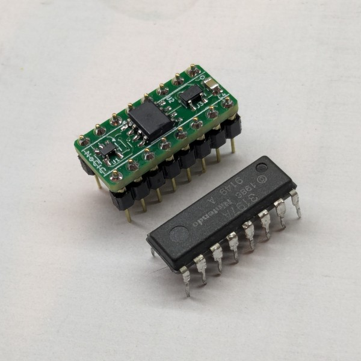
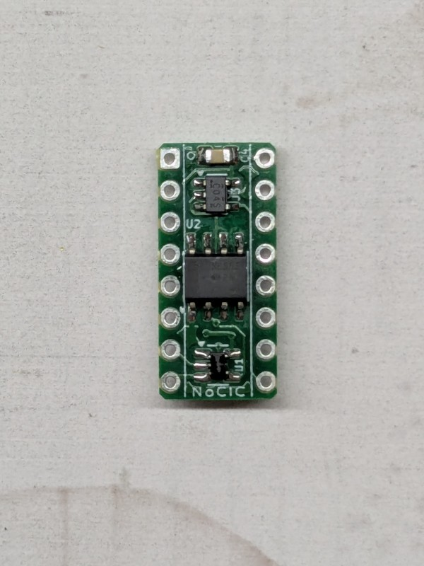

# NoCIC

## DISCLAIMER

Any use of this project is **under your own responsibility**.
You will be responsible of checking the correct construction and functionality of your board.
By using this project You will agree that I cannot be held responsible if it will destroy any of your devices, damage your computer, burn down your house or whatever.

### Sponsorship

This project is kindly sponsored by [PCBWay](https://pcbway.com).
PCBWay specializes in manufacturing high-quality PCBs and makes them affordable to hobbyist and professionals alike.

The range of services they offer include PCB prototyping, assembly, instant quotes for your order, a verification process by a team
of experts and an easy to use, hassle-free order process.

I'm grateful to PCBWay for the help in evolving and testing this project. You can order the currently released revisions of the board from them, see the link below!

## Introduction

This is a replacement of the NES CIC IC that implements the reset functionality, fits in a DIP16 footprint and... nothing else.

The [NullCIC](https://github.com/Redherring32/NullCIC/) already does this, but I faced some issues with it where the NES sometimes failed to startup properly during
a cold boot, and required a manual reset (possibly related to timing of my specific motherboard, even though the issues were not present with an original CIC installed).

Tweaking the cap and bodging a resistor on the NullCIC alleviated the issue by a lot, but I decided to go with something that allowed me to control the reset timing
a bit more reliably, and went with a classic 555 circuit.

The values for the components in the BOM should provide around 500ms of time in reset at startup.

This board was tested with two of my NES units without issues, let me know if it works for you!

## Hardware

The board was designed with [KiCad](https://kicad.org/) EDA.

### Bill of Materials

| Component              | Qty | Type / Value                                            | Notes                                                                |
| ---------------------- | --- | ------------------------------------------------------- | -------------------------------------------------------------------- |
| U1                     |  1  | 74LVC1G06 / SOT-23-5                                    |                                                                      |
| U2                     |  1  | 555, CMOS, SOIC-8                                       |                                                                      |
| U3                     |  1  | 74LVC1G04 / SOT-23-5                                    |                                                                      |
| C1, C4                 |  2  | 100nF / 16V+ / 0805                                     | MLCC                                                                 |
| C2                     |  1  | 10nF / 16V+ / 0805                                      | MLCC                                                                 |
| C3                     |  1  | 10uF / 16V+ / 0805                                      | MLCC                                                                 |
| C5                     |  1  | 470nF / 16V+ / 0805                                     | MLCC                                                                 |
| R1                     |  1  | 10K / 0805                                              |                                                                      |
| R2                     |  1  | 1M / 0805                                               |                                                                      |
| R3                     |  1  | 47K / 0805                                              |                                                                      |
| R4, R5                 |  2  | 2K ~ 10K / 0805                                         | Optional pull-downs for DI and DO, in case a fake CIC in the cart attempts to glitch us with spikes                  |
| J1                     |  2  | 8pin machined headers, 2.54mm pitch                     | Mount on the underside                                               |

JP1 can be optionally jumpered to allow the 555 to reset the CIC in the cart.

### Ordering the boards

You can order the board for this project at [PCBWay](https://www.pcbway.com/project/shareproject/NoCIC_Replacement_NES_CIC_8e238847.html) and support me or download 
the gerbers and have them printed wherever you like!!!

## TODO

- There are some "[reports](https://consolemods.org/wiki/NES:Disabling_CIC_Chip)" of overheating for games that attempt to glitch the CIC with voltage spikes if the CIC is not there. Find a way to test this with those games?